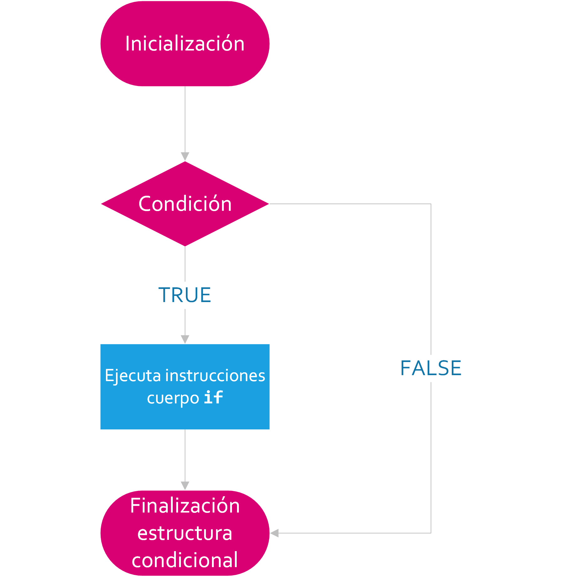
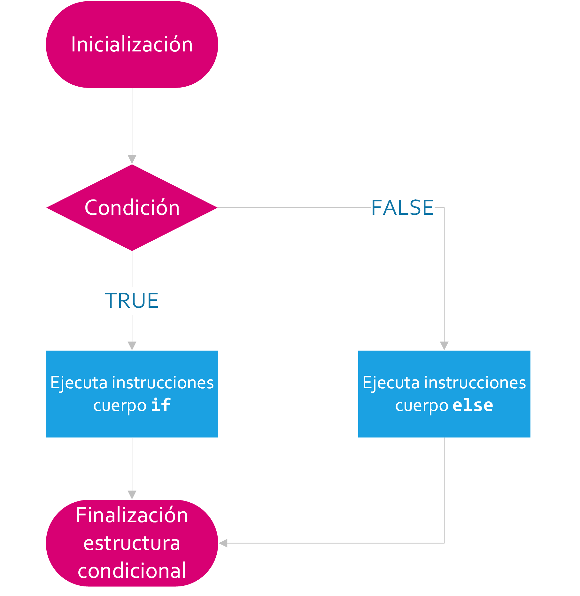
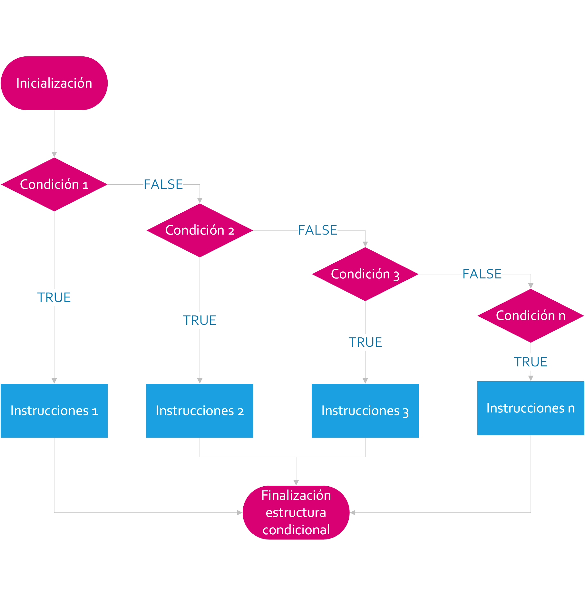
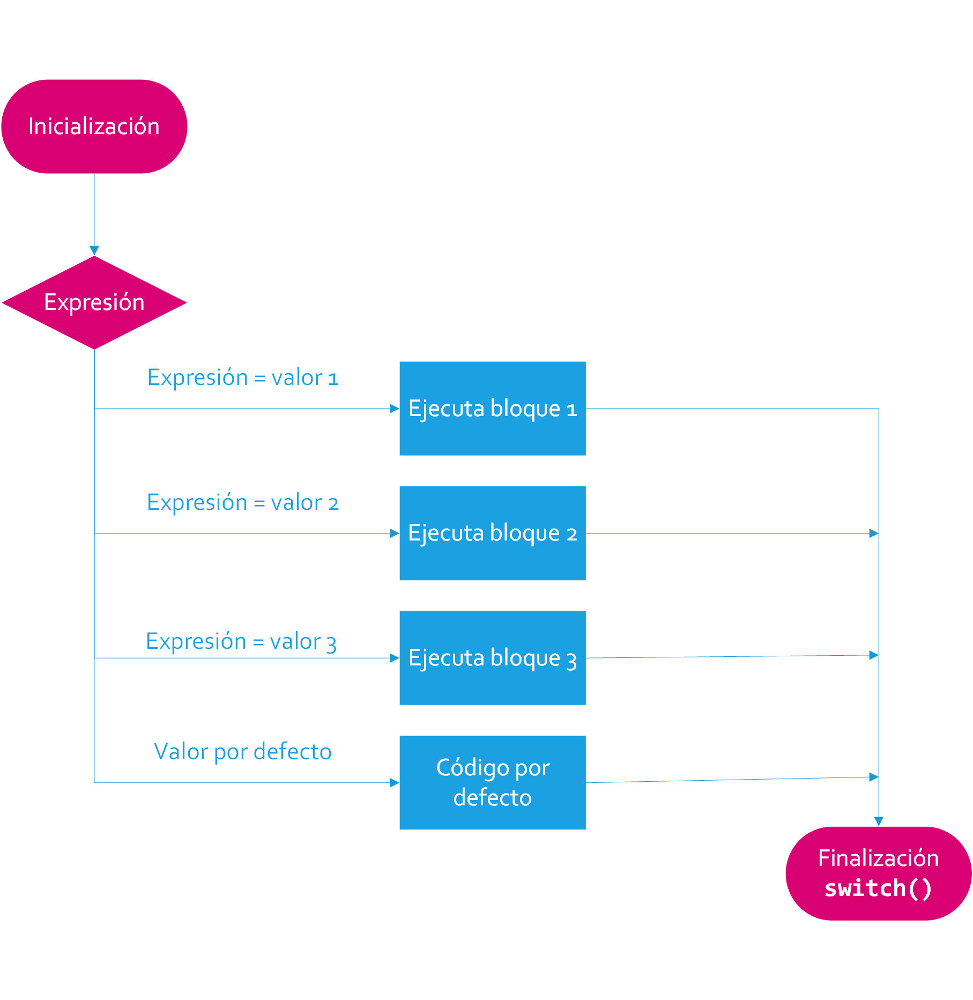

# Estructuras Condicionales

Las estructuras condicionales permiten la ejecución condicional de bloques de código.
La instrucción `if`, que en inglés tiene el mismo significado que nuestro "si" condicional,
permite evaluar una expresión y, sobre la base de su resultado (verdadero o falso), ejecutar
o no la instrucción o el bloque que le sigue. Es decir, si el resultado de la expresión es
verdadero, ejecuta el código. En caso contrario, el programa sigue su curso normal.

A continuación, mostramos el [diagrama](https://i.imgur.com/oGa0PW0.png) de flujo de `if`. En términos de diagramas de flujo, los rectángulos significan la realización de un proceso, en otras palabras la ejecución de un bloque de instrucciones. Por otro lado, los rombos son conocidos como símbolos de decisión, es decir se corresponden a preguntas cuyas respuestas únicamente tienen dos posibles respuestas, concretamente, TRUE (T) o FALSE (F).



La instrucción __`if`__ toma un valor lógico (en realidad, un vector lógico de longitud uno)
y ejecuta la siguiente instrucción sólo si el valor es __`TRUE`__:


```r
> if (TRUE) {
+   message("Es verdadero, se ejecutara la instruccion.")
+ }
```

```
Es verdadero, se ejecutara la instruccion.
```


```r
> if (FALSE) {
+   message("Es falso, no se ejecutara la instruccion.")
+ }  
```


En el caso que pasemos valores desconocidos (`NA`) a `if`, R lanzará un error:


```r
> if (NA) {
+   message("Los valores desconocidos lanzan un error")
+ }
```

```
Error in if (NA) {: missing value where TRUE/FALSE needed
```

Si nos encontramos ante esta situación, deberíamos comprobarlo mediante la función `is.na()`:


```r
> if (is.na(NA)) {
+   message("El valor es desconocido.")
+ }  
```

```
El valor es desconocido.
```

Desde luego, en nuestro código en pocas ocasiones pasaremos los valores
`TRUE` y `FALSE` a la instrucción `if`. En su lugar, pasaremos una variable o
expresión. En el siguiente ejemplo, `runif(1)` genera un número de forma aleatoria
entre 0 y 1. Si el valor es mayor que `0.5`, entonces el mensaje será mostrado:


```r
> if (runif(1) > 0.5) {
+   message("Este mensaje aparece con un 50% de probabilidad.")
+ }
```


Si pretendemos ejecutar un bloque de instrucciones, podemos envolverlo entre paréntesis:


```r
> x <- 3
> if (x < 2) {
+   y <- 2 * x
+   z <- 3 * y
+ }
```


__Recuerda__ que para que nuestro código sea lo mas legible posible, algunas [guías de estilo](../../sintaxis/guia_estilo/guia_estilo.md) 
recomiendan el uso de paréntesis, incluso si sólo queremos ejecutar condicionalmente
una sentencia.

El siguiente paso en complejidad en la sintaxis de `if` es incluir la cláusula `else`. Seguidamente se muestra el [diagrama de flujo](https://i.imgur.com/ohHqQXI.png) de `if-else`:




El código después de un `else` se ejecuta sólo si la condición en `if` es `FALSE`:


```r
> if (FALSE) {
+   message("Este bloque no se ejecuta...")
+ } else {
+   message("pero este si lo hará")
+ }
```

```
pero este si lo hará
```


Podemos definir múltiples condiciones combinando `if` y `else` repetidamente, este tipo de estructura se utiliza para probar __condiciones mutuamente excluyentes__. 

A continuación se muestra el [diagrama de flujo]((https://i.imgur.com/9dn41o5.png) de un `if-else` anidado. Como podemos observar se puden plantear múltiples condiciones simultáneamente: si se cumple la condición 1 se ejecuta el bloque de intrucciones 1. En caso contrario se comprueba la condición 2; si es cierta se ejecuta el bloque de sentencias 2, y así sucesivamente hasta __n__ condiciones. Si ninguna de ellas se cumple se ejecuta el bloque de instrucciones de `else`:



El siguiente ejemplo nos sirve para mostrar el anidamiento de instrucciones `if-else`. Pongamos el caso que deseamos crear un algoritmo que nos calcule la [medida de tendencia central](https://es.wikipedia.org/wiki/Medidas_de_tendencia_central) que deseemos, el siguiente fragmento de código podría ser una posible solución:


```
Error in library(modeest): there is no package called 'modeest'
```


```r
> # Creamos una muestra de 20 observaciones del 1 al 100 en
> # el que se pueden repetir hasta 2 observaciones
> (muestra <- sample(1:100, 20, 2))
```

```
 [1] 92 96 28 29 49 66 66 39  1 44 90 19 97 44 93 37 75 99 20 12
```

```r
> ## Creamos una variable indicando la medida de tendencia central
> ## que queremos calcular
> centralizacion <- "moda"
> 
> 
> ## Creamos un algoritmo para calcular la tendencia central que
> ## deseemos
> if (centralizacion == "moda") {
+    media = mean(muestra)
+    message("La media es ", as.character(media))
+ } else if (centralizacion == "mediana") {
+    mediana = median(muestra)
+    message("La mediana es ", as.character(mediana))
+ } else if (centralizacion == "moda") {
+    moda = mlv(muestra, method = "mfv")
+    message("La moda es ", as.character(moda))
+ } else {
+   message("Este algoritmo sola calcula la media,
+           mediana, moda")
+ }
```

```
La media es 54.8
```

## __`If`__ Vectorizado

La instrucción `if` estándar acepta en la condición lógica un único valor lógico. Si pasamos un vector lógico con una longitud
mayor que uno, R nos lo indicará mediante un __warning__ indicándonos que hemos introducido múltiples opciones, pero que 
únicamente la primera será utilizada:


```r
> if (c(TRUE, FALSE)) {
+   message("dos condiciones")
+ }
```

```
Warning in if (c(TRUE, FALSE)) {: the condition has length > 1 and only the
first element will be used
```

```
dos condiciones
```

Puesto que muchas de las operaciones en R son vectorizadas, R nos proporciona la función `ifelse`. La función `ifelse` toma tres argumentos. El primer argumento es un vector lógico de condiciones. El segundo es un vector que contiene los valores que
serán devueltos cuando el primer vector es `TRUE`. El tercero contiene los valores que serán devueltos cuando el primer vector
es `FALSE`.

#### Uso


```r
> str(ifelse)
```

```
function (test, yes, no)  
```


#### Argumentos

```{}
test: un objeto que pueda ser coercionado a un tipo lógico
yes:  devuelve los valores `TRUE` en los elementos de `test`
no:   devuelve los valores `FALSE` de `test` 
```

En el siguiente ejemplo, la función `rbinom` genera
números aleatorios de un distribución binomial simulando el lanzamiento de una moneda:


```r
> ifelse(rbinom(n = 10, size = 1, prob = 0.5),
+        "cara", "cruz")
```

```
 [1] "cara" "cruz" "cara" "cruz" "cara" "cara" "cara" "cara" "cruz" "cara"
```

No obstante, `if(test) yes else no` es mucho mas eficiente y preferible a `ifelse(test, yes, no)` cuando `test` es decir, la
condición lógica se trata de una expresión cuya longitud sea un vector de longitud igual a 1.


## Selección Múltiple con `switch()`

El código con muchas clausulas `else` puede hacer nuestro código difícil de leer. En estas circunstancias, podemos hacer uso de la función `switch()`, con la que conseguiremos un código mas legible y fácil de mantener. 

Para comprender mejor su funcionamiento pasemos a examinar el [diagrama de flujo](https://i.imgur.com/oGa0PW0.png) de la función `switch()`:




Esta función permite ejecutar una de entre varias acciones en función del valor de una expresión. Es una alternativa a los `if-else` anidados cuando se compara la misma expresión con diferentes valores.

El caso más común toma como primer argumento una expresión que devuelve un string, seguido por varios argumentos con nombre que proporcionan el resultado cuando el nombre coincida con el primer argumento. Cuando se encuentra la primera coincidencia, se ejecuta el bloque de instrucciones y se sale de función. Si no se encuentra ninguna coincidencia con ningún valor, se ejecuta el bloque de sentencias del argumento por defecto.

#### Uso


```r
> str(switch)
```

```
function (EXPR, ...)  
```

#### Argumentos

```{}
EXPR:  una expresión que evalua un string
... :  una lista con alternativas. Estas alternativas se les dará nombre, 
excepto a aquella que sea usada como valor por defecto.

```

Una alternativa al ejemplo presentado en el apartado anterior mediante la función `swith()` es la siguiente:


```
Error in library(modeest): there is no package called 'modeest'
```


```r
> # Creamos una muestra de 20 observaciones del 1 al 100 en
> # el que se pueden repetir hasta 2 observaciones
> (muestra <- sample(1:100, 20, 2))
```

```
 [1] 28  2 59 12 61 54 86 38 15 65 56 77 61  5 32 24 73 42 79 99
```

```r
> #Calculamos la media de la muestra
> (switch(
+   "media",
+   media = mean(muestra),
+   mediana = median(muestra),
+   moda = mlv(muestra, method = "mfv")
+ ))
```

```
[1] 48.4
```

Si ningún nombre coincide, entonces `switch` devuelve `NULL`:


```r
> # Intentamos calcular la desviación típica
> (switch(
+   "desviacion_tipica",
+   media = mean(x),
+   mediana = median(x),
+   moda = mlv(x, method = "mfv")
+   ))
```

```
NULL
```

En este escenario, podemos proporcionar un argumento por defecto sin nombre que `switch()` devolverá cuando no coincida ningún otro:


```r
> # Intentamos calcular la desviación típica
> (switch(
+   "desviacion_tipica",
+   media = mean(x),
+   mediana = median(x),
+   moda = mlv(x, method = "mfv"),
+   "Solo se puede calcular la media, mediana y moda"
+   ))
```

```
[1] "Solo se puede calcular la media, mediana y moda"
```

[if]:https://i.imgur.com/KhwkQbf.png
[if-else]:https://i.imgur.com/6HAkO6A.png
[if-else-anidados]:(https://i.imgur.com/9dn41o5.png
